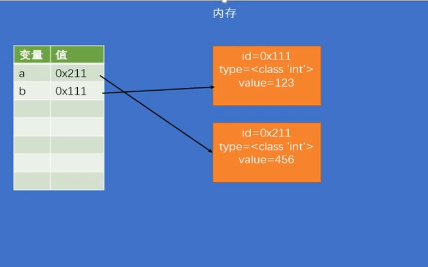

# 数据类型
    数据类型指的就是变量的值得类型，也就是可以为变量赋哪些值
        - 数值
             > 整型
                > 布尔值
             > 浮点型
             > 复数
        - 字符串
        - 空值
## 数值
    python中的数字分为三种类型：整数、浮点数以及复数
    整数
        - python中的所有整数都是int类型
        - python中的整数没有大小显示，可以是一个无穷大的数
            例如 99999999999999999999999999999999**1000  
            ** 表示幂
        - 如果数值长度过长，可以使用下划线分割，可以三位一格，也可以一位一格，没有具体要求
            例如 c = 9873_1234_5678
        - 十进制的数值不能以0作为开头
            例如 c = 0310 
        - 其他进制的整数，在输出打印时都会以十进制的形式输出
            例如 c = 0b10 的输出结果就是 2
        - 二进制 以0b开头
        - 八进制 以0o开头
        - 十六进制 以0x开头
        - 整数类型做运算的时候可以得到精确的结果
            例如 c = 12+13  输出结果为：25
    浮点数（小数）
        - python中所有的浮点数都是float类型
        - 浮点数做运算的时候会得到不太精确的结果
            例如 c = 0.1+0.2     输出结果为：0.30000000000000004
    
## 字符串
    字符串与长字符串
        - 用来表示一段文本信息，是程序中使用最多的数据类型，需要用' 或"来包裹
        - ' 和 " 不能跨行使用，如需跨行需要在每行末尾使用\,但是不会保留文本格式
        - 长字符串：''' 和 """ 可以跨行使用，并且会保留文本的原有格式
        - 转义字符：使用\作为转义字符，通过转义字符可以在字符串中使用一些特定内容
        - \uxxx表示Unicode编码
    格式化字符串
        - 直接使用+号拼接，无法拼接数字类型
        - print(a,b)传入两个参数，会依次打印输出，参数个数不限
        - 使用占位符，常用的有三种：
            > %s：string类型，也可拼接数字类型，但是无法控制小数点位数
                例如：c = '我是谁%3.5s'%123456# %3.5s中3.5表示最少三个位置，最多五个
            > %f：float类型，可以控制小数点位数，自动四舍五入
                例如：c = '我是谁%.2f'%1234.456# %0.2f中小数点之后最多2位，缺点是无法控制整数位
            > %d：整数类型，直接舍去小数点之后的数据
                例如：c = '我是谁%.2d'%1234.456# 缺点是无法控制整数位
        - pyhton3.x中的新特性，格式化字符串 可以直接在字符串之中写入变量
            例如：d = f'我是谁{a}{c}' 其中 a 和 c 表示变量，用{}来包裹，个数不限，会将依次拼接输出
    复制字符串
        - 通过运算符 * 来实现
            例如：'qwe'*2 输出结果为'qweqwe'

## 布尔值和空值
    布尔值
        - 布尔值只有两个值：True 和 False
        - 主要用来做逻辑运算
        - 布尔值实际上也是整型，True相当于1，False相当于0
    空值（None）
        - None专门用来表示不存在

## 类型检查
    type()函数用于检测变量类型，结果作为返回值，需用变量来接收
    例如：a=type('123') 和 b=type(123) 分别返回<class 'str'>和<class 'int'>

## 对象（object）
    - 程序运行时，所有的数据都是存储在内存中在运行的
    - 对象就是内存在用来存储数据的一块区域
    - 对象就是一个容器，专门用来存储数据
        例如 123 '等待' None  布尔值都是对象

## 对象的结构
    对象由三部分组成：id 、 type 和value
        - id(标识)
            > id用于标识对象，具有唯一性，每个对象有且仅有一个对应id值
            > id由解析器生成，在CPython中，id就是内存地址
            > 可以通过函数 id() 来查询id值
            > 对象一经创建，其id值就不能改变
        - type(类型)
            > type用于标识当前对象的数据类型
                例如：int str float bool
            > 类型决定了对象有哪些功能
            > 可以通过函数 type() 来确定对象的类型
            > python是强类型语言，对象一经创建类型就不能修改
        - value(值)
            > value就是对象中存储的具体数据
            > 有些对象的值是可变的
            > 对象分为两大类
                可变对象：可变对象的值可以改变
                不可变对象：不可变对象的值不可以改变

## 对象和变量
    - 变量并没有直接存储到内存中，变量相当于对象的别名
    - 变量中存储的不是对象的值，而是对象的id，我们使用变量的时候是通过id去寻找对应的value
    - 变量中保存的对象，只有在对变量重新赋值的时候才会改变
    - 变量和变量之间是相互独立的，修改一个变量并不会影响另一个变量

## 类型转换
    - 类型转换就是将一个类型的对象转换成其他对象
    - 类型转换并不是改变一个对象本身的类型，而是根据当前对象的值创建一个新的对象
    - 类型转换的四个函数
        > int() 转换成整数类型
            布尔值： True 为 1 False为0
            浮点数： 直接取整
            字符串： 合法的整数数值字符串，直接转换为相应数据
        > float() 转换成浮点数类型
        > str() 转换成字符串类型
        > bool() 转换成布尔类型
            所有表示空性（如：0 ，'' ， None）的都会转换成 False，其余均转换成 True